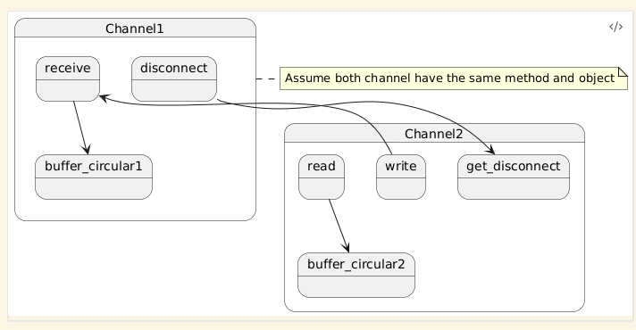
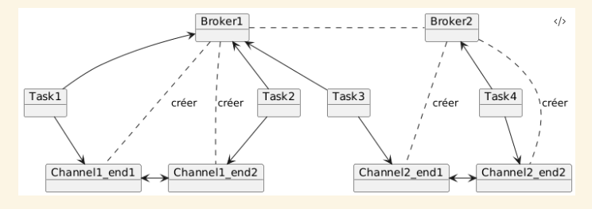

### When connection is accepted

A broker who accepted the connection create two objects channels that knows each other.
One channel is send to the broker who asked for the connection and then received by the task who asked for the connection.
The second channel is send to the task who accepted the connection.
Both channel have their own circular buffer.
if a task write with her channel then the bytes are send to the buffer of the other channel.
If a task read it will writes the bytes in her own buffer (the buffer that she gave in parameter) at the asked offset.
When the task read, it removes the length asked from her channel's buffer

There is no problem of syncronization

# How to connect

Chaque Broker à 2 Map une des connect et une des accept.
Pour la Map de accept nous avons des numéros de ports associés à des RDV
Pour la Map de connect nous avons des numéros de ports associés à une liste de RDV
Quand un Broker reçoit un accept il vérifie s'il y a déjà un connect avec le numéro de port associé.
Si oui il donne le RDV sinon on créer le rdv dans la Map des accepts avec le numéros de ports associé.
Quand un Broker reçoit un connect il vérifie s'il y a déjà un RDV dans la MAP accept avec le port associé.
SI oui on donne le RDV à celui qui a demandé sinon on créer le RDV et on l'ajoute avec le port associé à une liste des connect

Il faut bloquer le cas ou le Broker ne trouve pas de RDV et donc le créer alors pendant la création il ne pas y avoir la création d'un autre RDV en simultanée

# Broker

Les brokers se partagent une Map(un annuaire) avec comme clef le nom et en valeur l'objet broker

Pour récupèrer cet objet annuaire il y a une méthode static getAnnuaire() dans Broker
Quand un broker veut accèder à un autre Broker il regarde dans sa Map les différents Brokers disponibles

# Channel

# Global vision
